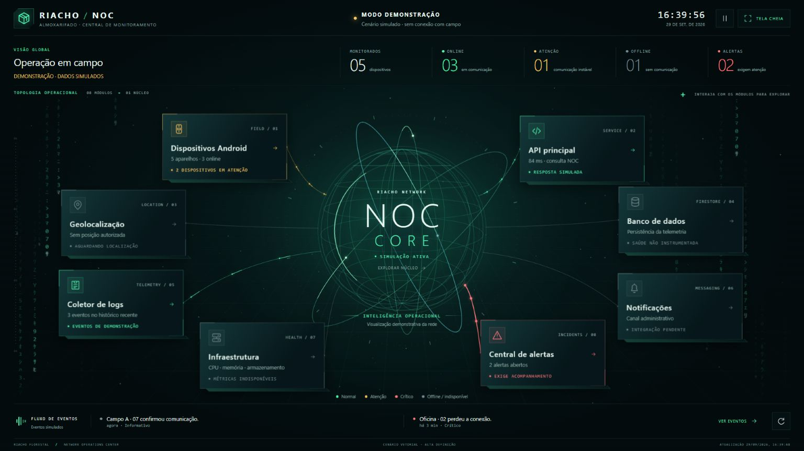

# Riacho Tech · NOC do Almoxarifado

Protótipo visual de uma central de monitoramento dos aplicativos Android usados em campo. O painel mostra dispositivos, eventos, alertas, conectividade e uma visão de infraestrutura em uma interface para operação em tela grande ou celular.

> **Estado atual: demonstração.** Os cinco dispositivos, alertas, eventos e a latência de 84 ms exibidos ao abrir o painel são dados simulados. O arquivo publicado não tem acesso aos APKs, ao servidor, ao banco ou à localização real de aparelhos. O mapa permanece indisponível sem configuração e posições autorizadas.

## Executar

Abra [`index.html`](index.html) em um navegador atualizado. O protótipo funciona sem instalação, servidor ou credenciais. Clique nos módulos para abrir detalhes; use o botão de atualização para renovar os dados simulados. A tecla `F` alterna tela cheia.

## O que existe neste repositório

- `index.html`: interface responsiva em HTML, CSS e JavaScript, com animação Canvas, filtros e modo demonstrativo.
- `assets/NOC.jpeg`: captura fornecida para a apresentação do painel no GitHub.
- `CONTRIBUTING.md`: orientações para sugestões e contribuições.
- `SECURITY.md`: cuidados com dados, credenciais e integração futura.

O painel contém um ponto de extensão para consultar `GET /noc-api/snapshot` com um token fornecido pela aplicação que o hospeda. **Esse backend, a autenticação, a instrumentação dos APKs, métricas reais de infraestrutura e um serviço de mapas não acompanham este protótipo.** A presença de telas e estados de serviço não significa que essas integrações estejam operando.

## Próximas etapas propostas

1. Definir o contrato da API, autenticação e autorização por perfil.
2. Instrumentar os APKs para enviar sinais de vida e diagnósticos com consentimento e retenção adequada.
3. Implementar ingestão, classificação online/offline, alertas, auditoria e métricas do servidor.
4. Validar a integração em homologação com dados de teste antes de qualquer operação real.

**Autoria do protótipo:** Rodrigo Donizetti Luciano. Projeto em testes; sugestões técnicas são bem-vindas via issues e pull requests.

Este repositório é público para discussão e colaboração. Uma licença de reutilização ou distribuição ainda não foi definida; a publicação do código, por si só, não concede essas permissões.
